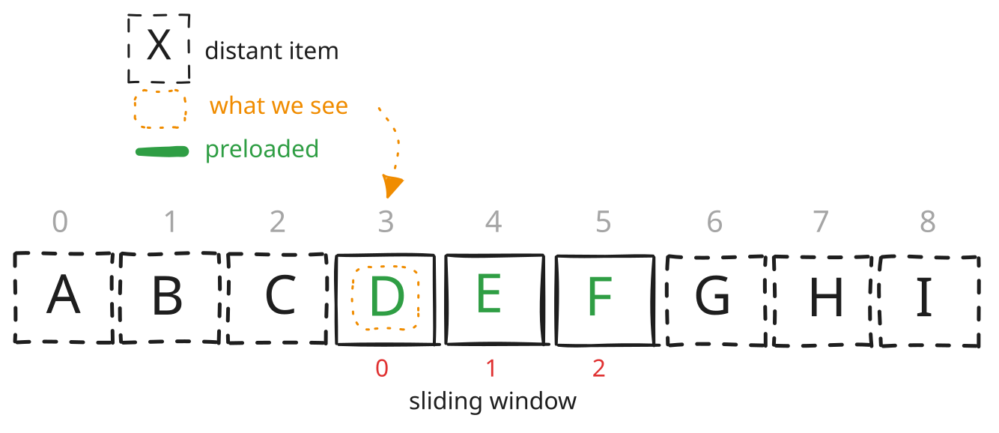

# croupier tool🃏
This tool offers files for downloading from disk (Yandex Disk)



It has prealoding feature (Sliding Window) and simple
WebUI exposed on `localhost:1234` by default.

Works for: **any** number of files; **any** starting point (offset) in a
folder; **any** preloading window size

Also you can change `lag` param to pick necessary preloading window skew.

Example for window size = 5:

`@` -- what we see

`*` -- preloaded *pages*

`_` -- pages on server

lag = 2

```
**@**
01234
```

lag = 0

```
@****
01234
```

# run on ARMv7l Kindle (Termux)

By default Termux doesnt expose DNS correctly so run like this:

```
CROUPIER_DNS=8.8.8.8:53 ./croupier
```

# how to build

## static build for ARMv7l

```
CGO_ENABLED=0 GOOS=linux GOARCH=arm GOARM=7 go build -trimpath -ldflags="-s -w" -o croupier .
```

## static build for amd64

```
CGO_ENABLED=0 GOOS=linux GOARCH=amd64 go build -trimpath -ldflags="-s -w" -o croupier-linux-amd64 .
```

## TODO

- add config
- add proper logging
